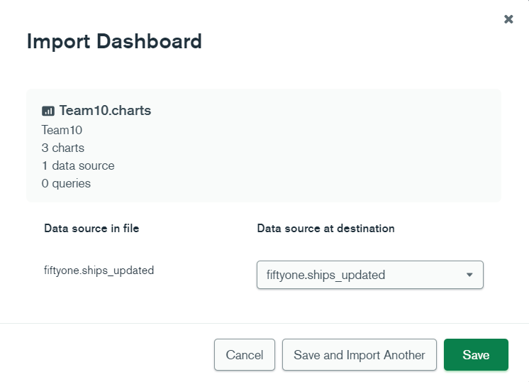

# Hackathon-team10
SA Hackathon - Team 10 

# Details

-- Project : "RAMBO (Realtime Analysis for Maritime Battle Operations)"
-- Team Number : 10  
-- Team Name : Space Force 10
-- Demonstration Video : 

# Overview #

NATO Alliance Countries are building an Alarm System for monitoring Ukraine coastline  and flagging the status of the Black Sea Coast line by sending alert flags (Red, Blue, Green )to the Ukrainian forces.

The idea for building a Dashboard is simple . NATO alliance countries are aggregating all the images of the coast of Black Sea collected via satellites and surveillance aircrafts. These Images will be processed through an image processing tool called VOXEL51 . This tool will generate metadata based on the images, detecting the vessels and predicting the kind/category of vessel . For example these vessels could be Commercial Cargos, Commercial Oil Tankers or Warships, Frigates Destroyers  or aircraft carriers. 

All these images are collected constantly and metadata data that is generated via  VOXEL51  is merged/loaded to the Mongo Atlas Database. 

As the Data gets loaded  to a mongo Collections it is constantly indexed using Atlas Search to make this data searchable. The Search supports fuzzy logic , synonyms as different Assets (as in Ships ) may have different names in different countries 

Atlas charts will use this real time data to update the dashboard for constant monitoring . A pie chart can report the percentage of non-military vessels vs commercial vessels vs humanitarian vessels like red cross  or peace corps.

Chart will also have a Heat Map of Ukraine’s Black Sea coast line highlighting military activity.

For building this dashboard for the Command Control Center  Nato Alliance Countries have selected a set of tools.

- VOXEL51  for AI  processing and metadata generation  
- MongoDB Atlas 
- Atlas Search
- Atlas Charts.

VOXEL51 has leveraged the power of the MongoDB database to help develpoers and data scientists build and optimize object detection and classification algorithms


# Justification #

Realtime analytics are is the big challenge of our times 

MongoDB Competitive differentiators
- Developer Velocity
- Native GeoJSON capablity
- Integrated Atlas Search 
- Integrated Charts


# Detailed Application Overview #

### Architecture: ###


### MongoDB Components/products used: ###

- MongoDB Atlas
- MongoDB Atlas Search 
- MongoDB Atlas Charts
- MongoDB Atlas Triggers


### Workings: ###
1. Satellite Images collection
2. Real Time processing of images  via VOXEL51 to metadata. 
3. Ingest data using 
4. Aggregate and modify the Data.
5. Index using Atlas search for Quick search 
6. Atlas Search w/ synonyms with user interface
7. Setup Trigger Warning upon threat detection 
8. Build Command Control Dashboard for Monitoring.


# Roles and Responsibilities #

- Charlie Little : Data Model , Dataset Generation
- Dhananjay Ghevde : Demo Story Line, Aggregation Pipeline, Git Hub 
- Cassiano Bien : Search 
- Alek : Charts , Dashboard
- Sharath :  Triggers, Video 
- Andrew Lavoie : Python, Geoloc Generation

# Demonstration Script #

## Setup ##

### Fifty One Installation and Run: ###

If you have a Apple computer and doesn't have Apple Command Line Tools installed, run this command:
```
xcode-select --install
```
Install Python virtualenv:
```
brew install virtualenv
```

````
virtualenv venv
source venv/bin/activate
````

Install Fiftyone by running these commmads: 
```
pip install --upgrade pip setuptools wheel
pip install fiftyone
```
#### 
need  writeup to run the fiftyone tool

### Data Enrichment  ###
Two python scripts will be ran to transform the ships data set into a usable dataset of occurences, as well as geolocation formatting.
```
brew install geos
python3 -m pip install Shapely pymongo json
python3 ship_data_transformation.py 
python3 add_geo.py
````
### Search Setup ###

#### Setup Indexes ####

- Setup default indexes 
````
{
  "mappings": {
    "dynamic": true
  }
}
````

- Setup Autocomplete Index for searching 

````
{
  "mappings": {
    "dynamic": true,
    "fields": {
      "ground_truth": {
        "fields": {
          "detections": {
            "fields": {
              "label": [
                {
                  "dynamic": true,
                  "type": "document"
                },
                {
                  "type": "autocomplete"
                }
              ]
            },
            "type": "document"
          }
        },
        "type": "document"
      }
    }
  }
}

````
- Setup facets Index for searching 
````
{
  "mappings": {
    "dynamic": true,
    "fields": {
      "ground_truth": {
        "fields": {
          "detections": {
            "fields": {
              "Ship_area": {
                "type": "numberFacet"
              },
              "Ship_location": {
                "type": "stringFacet"
              },
              "Ship_size": [
                {
                  "dynamic": true,
                  "type": "document"
                },
                {
                  "type": "stringFacet"
                }
              ],
              "label": {
                "type": "stringFacet"
              }
            },
            "type": "document"
          }
        },
        "type": "document"
      }
    }
  }
}
````


#### Run Search UI ####


### Charts Setup ####
#### Activate Charts ###

Setup the Data sources pipeline


#### Import the Dashboard template ####

To locate the Template file navigate to : hackathon-team10/charts/template




#### Configure Charts ####
Make the following changes in /charts/src/index.js  

````
const sdk = new ChartsEmbedSDK({
  baseUrl: "https://charts.mongodb.com/charts-team10-zpnrs" //REPLACE with your Atlas Charts base URL
});
````

Edit following lines to replace the chartId for each of the 3 charts

````
const shiptypeChart = sdk.createChart({
  chartId: "6230e742-1a35-4481-8e2c-45c3c28ca2ca", //REPLACE with your chartId
});
````

````
const gaugeChart = sdk.createChart({
  chartId: "6230fce0-5885-423c-8d42-918f35a59673", //REPLACE with your chartId
});
````
````
const heatmapChart = sdk.createChart({
  chartId: "d1b34399-6c03-431d-8c4b-858536a61919", //REPLACE with your chartId
})
````

#### Run Charts ####

````
cd charts
npm install 
npm start 
````


# About VOXEL51 #


Object detection algorithams are being used for many real-world use cases. Real-time detection allows all kinds of challenges for collecting and acting on opportunities and threats.


## Resources: ##

- https://voxel51.com/docs/fiftyone/index.html

- https://cloud.mongodb.com/v2/622fa89e695aa705f173de8f#clusters

## Data set sources: ##

- https://github.com/zzndream/ShipRSImageNet


